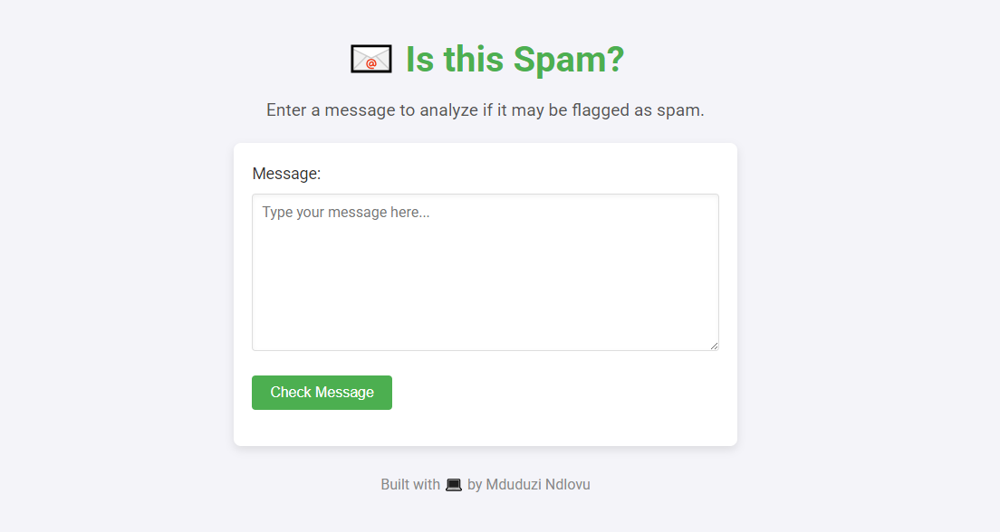

# Spam Message Checker


### Demo Link: https://mduduzindlovu-dev.github.io/Spam-Filter/

## Overview
The *** Spam Message Checker *** was born out of my personal quest to put an end to the endless parade of spam messages clogging up my inbox. Whether it’s the infamous “Nigerian prince” generously offering me millions (if only I’d send my bank details) or some too-good-to-be-true offer of free money, this tool helps me spot the nonsense before I even think about falling for it.

Using JavaScript, I built this project to detect and flag potential spam based on common patterns. It’s a handy little filter to keep my digital life a bit less chaotic, while also being a fun way to dive into regular expressions, DOM manipulation, and event handling. Because let’s face it—if a prince needs my help, he can at least call me. 😄

## Features
- **Spam Detection Logic**: Utilizes regular expressions to detect patterns commonly associated with spam messages.
- **Dynamic Feedback**: Provides real-time feedback to users, indicating whether their message is flagged as spam.
- **Regex Pattern Matching**: Covers a variety of spam scenarios, including:
  - Requests for assistance (e.g., "Please help," "Assist me").
  - Mentions of monetary amounts (e.g., "100 dollars," "thousand dollars").
  - Phrases like "free money" with leetspeak variations.
  - Stock-related spam (e.g., "stock alert").
  - Generic phishing phrases (e.g., "Dear friend").
- **Input Validation**: Ensures the message input is not empty before processing.

## Key Technologies
- **HTML**: For the structure of the input form and result display.
- **CSS**: for styling the UI if implemented.
- **JavaScript**: For the core functionality, including spam detection and user interaction.

## How It Works
1. **User Interaction**:
   - The user types a message into the input field and clicks the "Check Message" button.
2. **Spam Detection**:
   - The input message is tested against a deny list of regular expressions.
   - If any pattern matches, the message is flagged as spam.
3. **Result Display**:
   - A message is shown to the user indicating whether their input is spam or not.
4. **Input Reset**:
   - The input field is cleared after each check.

## Example Usage
1. **Input**: "Please help me with 500 dollars."
   - **Output**: "Oh no! This looks like a spam message."

2. **Input**: "Hello, how are you?"
   - **Output**: "This message does not seem to contain any spam."

## Project Structure
- **HTML**: Contains the input form and result display.
- **CSS**: used for styling.
- **JavaScript**:
  - `isSpam(msg)`: Checks if the input message matches any pattern in the deny list.
  - Event listener for handling button clicks and updating the UI dynamically.

## Regular Expression Patterns
The following patterns are checked:
- **Help Requests**: `please help|assist me`
- **Monetary Mentions**: `[0-9]+\s*(?:hundred|thousand|million|billion)?\s+dollars`
- **Free Money**: `(?:^|\s)fr[e3][e3] m[o0]n[e3]y(?:$|\s)`
- **Stock Alerts**: `[s5][t7][o0][c{[(]k [a@4]l[e3]r[t7]`
- **Dear Friend**: `(?:^|\s)d[e3][a@4]r fr[i1|][e3]nd(?:$|\s)`

## Installation
1. Clone the repository:
   ```bash
   git clone https://github.com/MduduziNdlovu-dev/Spam-Filter.git
   ```
2. Open the `index.html` file in a browser to run the project locally.

## Future Improvements
- Add support for more complex spam detection patterns.
- Enhance the user interface with CSS for better aesthetics.
- Allow users to customize or extend the deny list dynamically.
- Implement a backend to log and analyze spam detection trends.

## Contact
If you have any questions or would like to discuss this project further, feel free to reach out:
- **Name**: Mduduzi Ndlovu
- **Email**: Mduduzindlovu02@gmail.com

---

This project highlights my skills in JavaScript, regex pattern matching, and building interactive web applications. I look forward to discussing how I can bring value to your team!